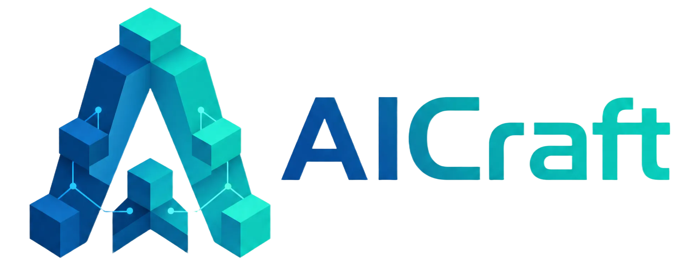
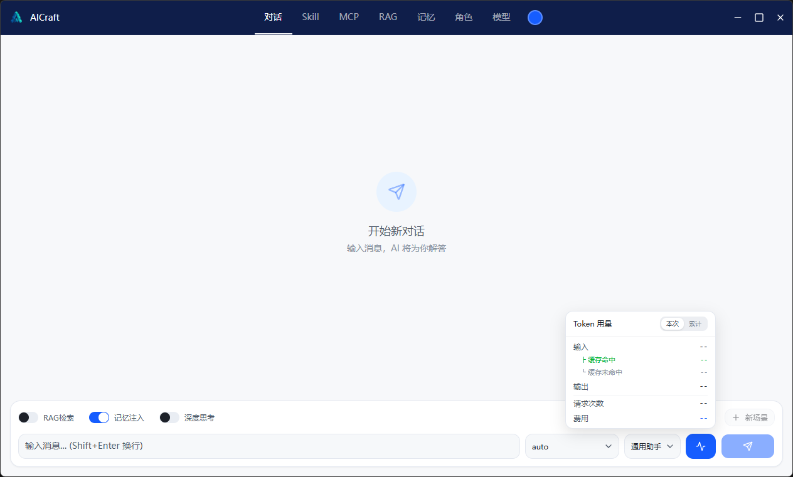
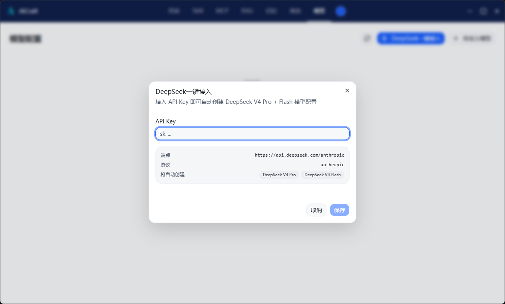

    
  <b>Load your AI agent like Minecraft mods</b>  
  

    
    
    
    
    
  

---

## 🎮 AICraft 是什么？

AICraft 是一个**桌面 AI 能力启动器**——就像 PCL 启动器管理 Minecraft 的 mod 一样，AICraft 让你用可视化界面管理 LLM 的 Skill、MCP、RAG、记忆等能力模块。

装好就能用，不用亲自预安装任何环境。填入 API Key，开聊。

   
  <i>对话界面：RAG / 记忆 / 深度思考 / Auto路由 / Token计费，开箱即用</i>

## ✨ 功能特性

1. 🚀 **DeepSeek 一键接入** — 填入 Key，自动创建 V4 Pro + Flash 双模型配置

   
  <i>一键接入 DeepSeek，无需手动配置模型参数</i>

2. 🎭 **角色快切** — 一键切换预设角色，不同场景不同风格
3. 🧩 **Skill 管理** — 可视化管理 Skill 模块，热插拔式加载
4. 🔧 **MCP 管理** — 文件管理 + Python 执行，Agent 真正能动手
5. 📚 **本地 RAG** — 构建自己的本地知识库，ChromaDB 向量检索，数据不出本机
6. 🧠 **三层记忆** — 实时 / 短期 / 长期，跨会话记忆持久化
7. 💭 **深度思考** — 支持 DeepSeek 深度思考模式，推理更深入
8. 💰 **实时 Token 计费面板** — 实时统计用量与费用，缓存命中单独展示
9. 🤖 **上下文预算管理** — 6 级优先级裁剪，1M 上下文不浪费

## 🚀 快速开始

### 1. 下载安装

从 [Releases](https://github.com/Easlie114514/AICraft/releases) 下载最新版，解压运行 `AICraft.exe`

### 2. 一键接入 DeepSeek

首次打开 → 点击「模型」→ 点击「DeepSeek 一键接入」→ 粘贴 API Key → 保存

### 3. 开聊

就这样，你已经拥有一个带搜索、文件管理、RAG、记忆的桌面 Agent 了。

## 🧩 能力模块

| 模块 | 说明 | 出厂预置 |
|------|------|---------|
| **Skill** | 角色风格 prompt 注入 | 4 个：通用 / 技术 / 创作 / 分析 |
| **MCP** | 可执行工具（文件管理 + Python 执行） | 2 个：filesystem / code_executor |
| **RAG** | 本地向量检索（ChromaDB） | 3 篇：使用手册 / 开发指南 / FAQ |
| **记忆** | 三层架构（L0 实时 → L1 短期 → L2 长期） | 自动运行 |
| **角色** | 预设人格模板 | 自由创建 |

## 🛠️ 技术栈

**后端** — Python · FastAPI · ChromaDB · httpx  
**前端** — React 19 · Vite 8 · TailwindCSS 4 · Shadcn UI  
**打包** — PyInstaller onedir · 316 MB

## 🗺️ 后续计划

- [ ] 多模态输入（文件 + 图片上传）
- [ ] AI 返回文件（工具产出 CSV 等文件）
- [ ] SkillHub 社区市场
- [ ] Token 计费增强（历史可查、导出）

## 📄 License

[Apache 2.0](LICENSE)

---

  Built with ❤️ by <a href="https://github.com/Easlie114514">Easlie</a>

