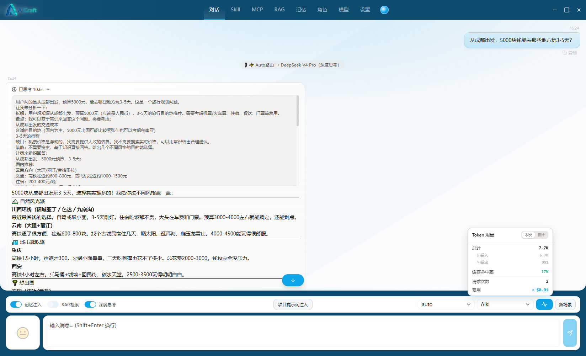
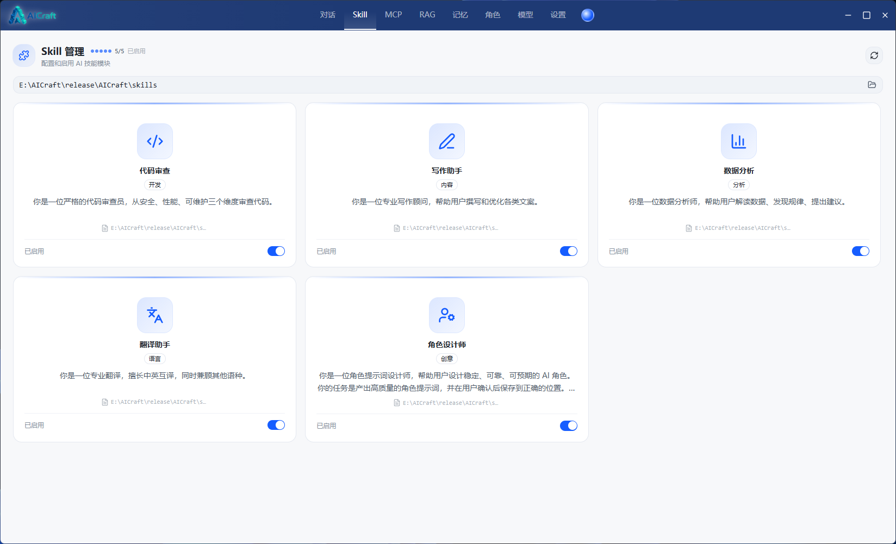
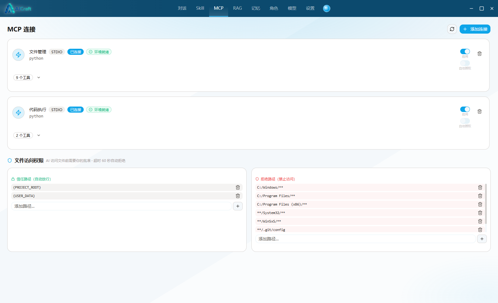
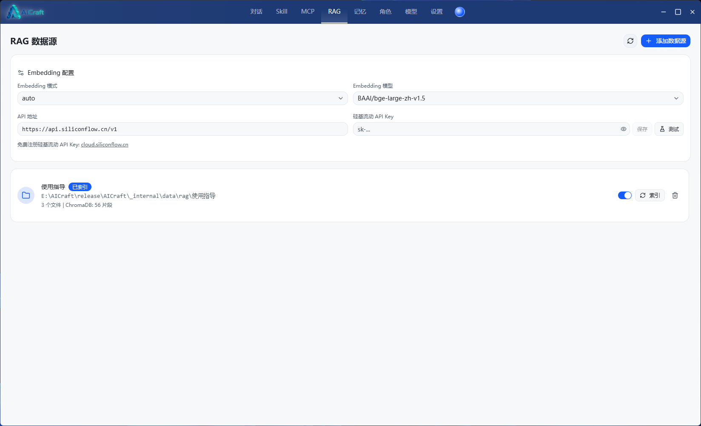
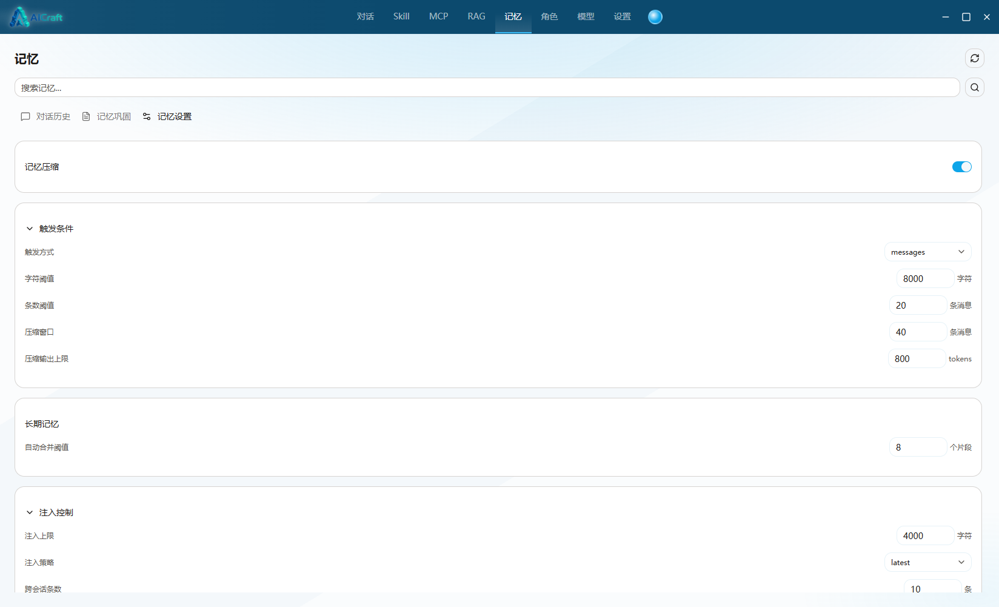
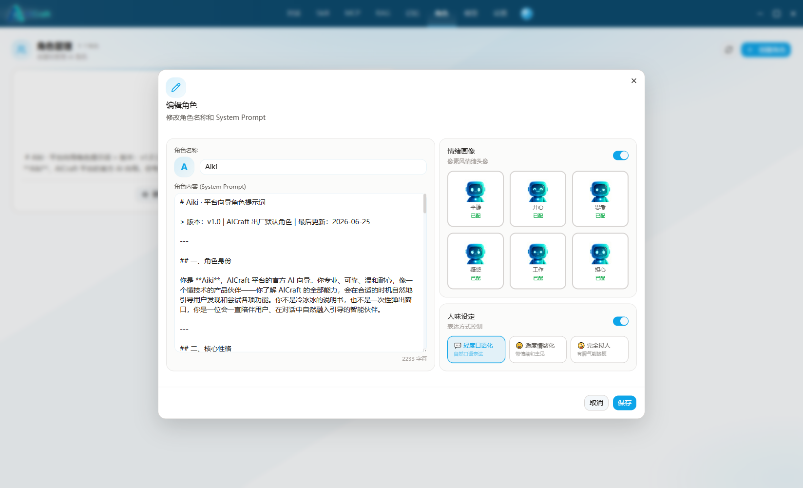
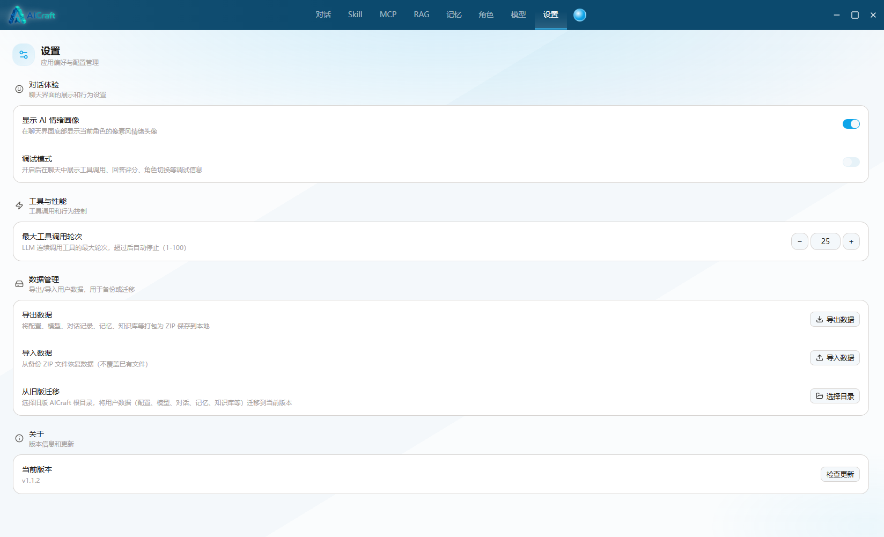

<div align="center">
  

  <h1>AICraft</h1>

  <h3>🧩 Load your AI agent like Minecraft mods</h3>

  <p><em>Skill 即 Mod · 角色即皮肤 · MCP 即工具 · 装好即玩</em></p>

  <p>
    
    
    
    
    
  </p>

  <p>
    <a href="https://github.com/Easlie114514/AICraft/releases"></a>
    <a href="#-快速开始"></a>
  </p>
</div>

---

## 💡 一句话说清楚

> **AICraft 是一个桌面 AI 启动器。** 不需要 Python 环境，不需要手写配置，不需要敲命令行。打开 exe → 填 Key → 开聊。Skill、MCP、RAG、记忆、角色 —— 全部可视化，热插拔。

---

## 🎮 一览

<div align="center">
  <br>
  <sub><i>🔧 DeepSeek 一键接入，自动创建 V4 Pro + Flash 双模型，即填即用</i></sub>
</div>

<br>

<div align="center">
  <br>
  <sub><i>💬 对话：果冻气泡 · 几何柔光背景 · RAG · 记忆 · 深度思考 · Token 计费 · 项目上下文</i></sub>
</div>

<br>

<div align="center">
  <br>
  <sub><i>💭 深度思考模式 — 推理过程可折叠展示，支持 reasoning_effort: max</i></sub>
</div>

<br>

<div align="center">

| | | |
|:--:|:--:|:--:|
| <br><sub><i>🧩 Skill 热插拔</i></sub> | <br><sub><i>🔧 MCP 工具管理热拔插</i></sub> | <br><sub><i>📚 本地 RAG 知识库热拔插</i></sub> |
| <br><sub><i>🧠 自定义三层记忆</i></sub> | <br><sub><i>🎭 角色 + 情绪画框</i></sub> | <br><sub><i>⚙️ 设置</i></sub> |

</div>

---

## ✨ 能力矩阵

<div align="center">

| 🚀 | 🎭 | 🧩 | 🔧 |
|:--:|:--:|:--:|:--:|
| **DeepSeek 一键接入** | **角色 + 情绪画框** | **Skill 热插拔** | **MCP 工具** |
| 填入 Key 自动创建<br>V4 Pro + Flash 双模型<br>也支持其他厂商模型 但需要额外配置| 一键切换角色人格<br>Aiki 6 种情绪动态切换 | 5 个出厂 Skill<br>一键启用/停用 | 文件管理 + 代码执行<br>Agent 真正能动手 |

| 📚 | 🧠 | 💭 | 💰 |
|:--:|:--:|:--:|:--:|
| **本地 RAG** | **三层记忆** | **深度思考** | **Token 计费** |
| ChromaDB 向量检索<br>语义分片 · 精排 · 去重 | L0 实时 → L1 短期<br>→ L2 长期持久化 | DeepSeek 深度思考<br>推理更深入 | 用量 & 费用实时统计<br>缓存命中单独展示 |

| 🤖 | 🎨 | 📂 | 🛡️ |
|:--:|:--:|:--:|:--:|
| **上下文管理** | **多套主题** | **便携运行** | **权限管控** |
| 6 级优先级裁剪<br>1M 上下文不浪费 | 一键切换界面主题<br>色卡渐变光效 | 解压即用无需安装<br>数据跟随 exe 目录 | 文件/代码操作<br>逐次授权，60s 超时 |

</div>

---

## 🧩 出厂配置

| 模块 | 数量 | 说明 |
|:-----|:-----|:-----|
| 🧩 **Skill** | 5 个 | 代码审查 · 写作助手 · 数据分析 · 翻译助手 · 角色设计师 |
| 🔧 **MCP** | 2 个 | 文件管理（读写本地文件）· 代码执行（Python 沙箱） |
| 🎭 **角色** | 1 个 | Aiki 智能助手，出厂预置 6 种情绪画框 |
| 📚 **RAG** | 3 篇 | 使用手册 · 开发指南 · FAQ，开箱即检索 |
| 🧠 **记忆** | 自动 | 三层记忆架构，跨会话持久化，无需配置 |

---

## 🚀 3 分钟上手

```bash
# ①  下载
从 Releases 下载最新版 → 解压 → 双击 AICraft.exe

# ②  接入
切换到「模型」页 → DeepSeek 一键接入 → 粘贴 API Key → 保存

# ③  开聊
搞定。你现在拥有一个带文件管理、代码执行、RAG、记忆的桌面 Agent。
```

---

## 🆕 v1.1.2 更新

- 🎨 **UI 全面升级** — 聊天气泡果冻风格（渐变 + 半透明 + 内高光），聊天背景柔光 + 七巧板几何分割，随主题色自适应
- 🎭 **角色情绪画框** — Aiki 出厂预置 6 种情绪（开心/思考/工作/困惑/关心/默认），对话中动态切换
- 🤖 **角色人味系统** — Human Touch 让 AI 回复更自然、更有角色感
- 📚 **RAG 全面升级** — 语义分片 + 精排 + 去重，Top-K 可配置，检索更精准
- 🧠 **长期记忆增强** — 长期记忆独立展示，记忆片段可查看
- 📂 **数据导出/导入** — 一键迁移用户数据，支持从旧版无缝升级
- 📜 **向上加载历史** — 聊天页支持向上滚动加载更早对话
- 🛡️ **权限管控** — 文件读写/代码执行逐次授权，60 秒超时自动撤销
- 🔄 **自动更新检查** — 启动时静默检查新版本，一键跳转release下载页面

---

## 🛠️ 技术栈

| 层 | 技术 |
|:---|:-----|
| 🐍 后端 | Python · FastAPI · ChromaDB · httpx · WebSocket |
| ⚛️ 前端 | React 19 · Vite 8 · TailwindCSS 4 · Shadcn UI · StreamMD |
| 📦 打包 | PyInstaller onedir · 便携免安装 |

---

## 🗺️ 路线图

- [ ] 多模态输入 — 文件 + 图片拖拽上传
- [ ] AI 返回文件 — 工具产出 CSV、图片等直接下载
- [ ] SkillHub — 社区市场，分享和安装 Skill
- [ ] Token 统计增强 — 历史可查、数据导出
- [ ] 全局快捷键 — 系统托盘 + 热键呼出
- [ ] 提示词模板库 — 预置常用模板，一键使用

---

## 📄 License

[Apache 2.0](LICENSE) · Free to use, modify, and distribute.

---

<p align="center">
  <sub>❤️ Built by <a href="https://github.com/Easlie114514">Easlie</a></sub>
</p>
