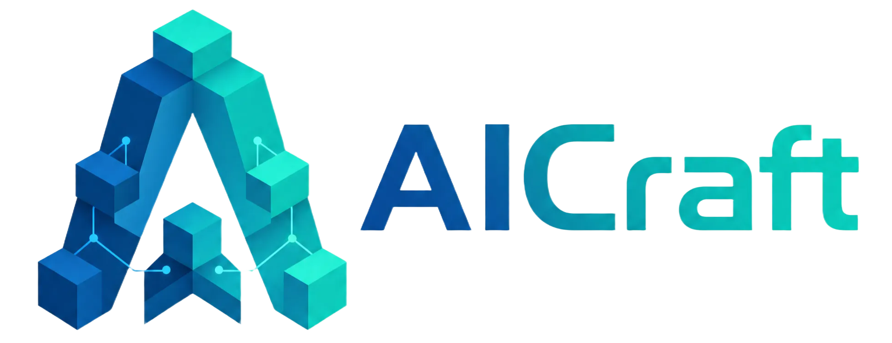
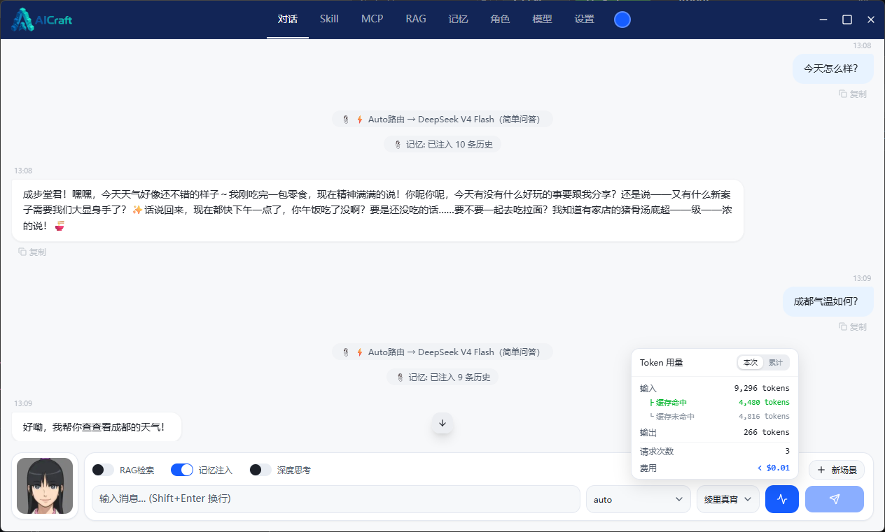
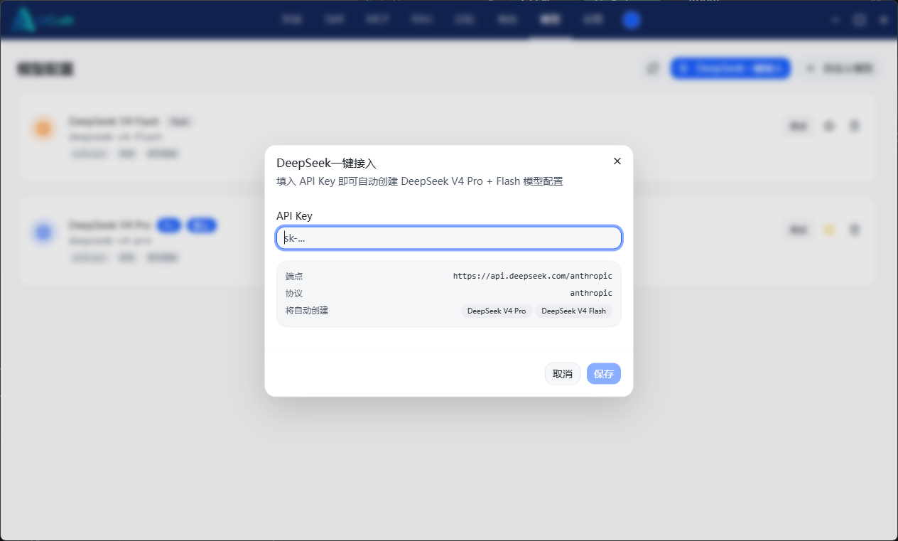

<div align="center">
  

  <h1>AICraft</h1>

  <h3>🧩 像玩 Minecraft 一样组装你的 AI 助手</h3>

  <p><em>Skill 即 Mod · 角色即皮肤 · MCP 即工具 · 装好即玩</em></p>

  <p>
    
    
    
    
    
  </p>

  <p>
    <a href="https://github.com/Easlie114514/AICraft/releases"></a>
    <a href="#-快速开始"></a>
  </p>
</div>

---

## 💡 一句话说清楚

> **AICraft = 桌面 AI 启动器。** 不需要 Python 环境，不需要手写配置，不需要敲命令行。打开 exe → 填 Key → 开聊。Skill、MCP、RAG、记忆、角色 —— 全部可视化，热插拔。

---

## 🎮 预览

<div align="center">
  <table><tr>
    <td><br><sub><i>💬 对话界面：RAG / 记忆 / 深度思考 / Token计费，开箱即用</i></sub></td>
    <td><br><sub><i>🔧 DeepSeek 一键接入，无需手动配置模型参数</i></sub></td>
  </tr></table>
</div>

---

## ✨ 功能

<!-- 卡片式网格：用 HTML table 在 GitHub 也能出效果 -->

<div align="center">

| 🚀 | 🎭 | 🧩 | 🔧 |
|:--:|:--:|:--:|:--:|
| **DeepSeek 一键接入** | **角色快切** | **Skill 热插拔** | **MCP 工具管理** |
| 填入 Key 自动创建<br>V4 Pro + Flash 双模型 | 一键切换自定义<br>预置AICraft智能小助手 | 可视化加载/卸载<br>5 个出厂 Skill | 文件管理 + Python 执行<br>Agent 真正能动手 |

| 📚 | 🧠 | 💭 | 💰 |
|:--:|:--:|:--:|:--:|
| **本地 RAG** | **三层记忆** | **深度思考** | **实时 Token 计费** |
| ChromaDB 向量检索<br>数据不出本机 | L0 实时 → L1 短期<br>→ L2 长期持久化 | DeepSeek 深度思考<br>推理更深入 | 用量 & 费用实时统计<br>缓存命中单独展示 |

| 🤖 | 🎨 | 📂 | |
|:--:|:--:|:--:|:--:|
| **上下文预算管理** | **9 套主题色卡** | **便携运行** | |
| 6 级优先级裁剪<br>1M 上下文不浪费 | 一键切换界面主题 | 数据存 exe 同级目录<br>解压即用，无需安装 | |

</div>

---

## 🧩 能力模块一览

| 模块 | 做什么 | 出厂自带 |
|:-----|:-------|:---------|
| 🧩 **Skill** | 角色风格 prompt 注入，一键切换对话风格 | 5 个：通用 / 技术 / 创作 / 分析 / 角色设计师 |
| 🔧 **MCP** | 可执行工具，Agent 能读写文件、运行代码 | 2 个：filesystem / code_executor |
| 📚 **RAG** | 本地向量检索，构建私有知识库 | 3 篇：使用手册 / 开发指南 / FAQ |
| 🧠 **记忆** | 三层架构，跨会话记住你 | 自动运转，无需配置 |
| 🎭 **角色** | 预设人格模板，保留记忆同时无痕切换 | Diana · 绫里真宵等，支持自定义 |

---

## 🚀 3 分钟上手

```bash
# ①  下载
从 Releases 下载最新版 → 解压 → 运行 AICraft.exe

# ②  接入
模型 → DeepSeek 一键接入 → 粘贴 API Key → 保存

# ③  开聊
搞定。你现在拥有一个带搜索、文件管理、RAG、记忆的桌面 Agent。
```

---

## 🛠️ 技术栈

| 层 | 技术 |
|:---|:-----|
| 🐍 后端 | Python · FastAPI · ChromaDB · httpx · sentence-transformers |
| ⚛️ 前端 | React 19 · Vite 8 · TailwindCSS 4 · Shadcn UI |
| 📦 打包 | PyInstaller onedir · 316 MB |

---

## 🗺️ 路线图

- [ ] 多模态输入 — 文件 + 图片拖拽上传
- [ ] AI 返回文件 — 工具产出 CSV、图片等直接下载
- [ ] SkillHub — 社区市场，分享和安装 Skill
- [ ] Token 统计增强 — 历史可查、数据导出

---

## 📄 License

[Apache 2.0](LICENSE) · Free to use, modify, and distribute.

---

<p align="center">
  <sub>❤️ Built by <a href="https://github.com/Easlie114514">Easlie</a></sub>
</p>
